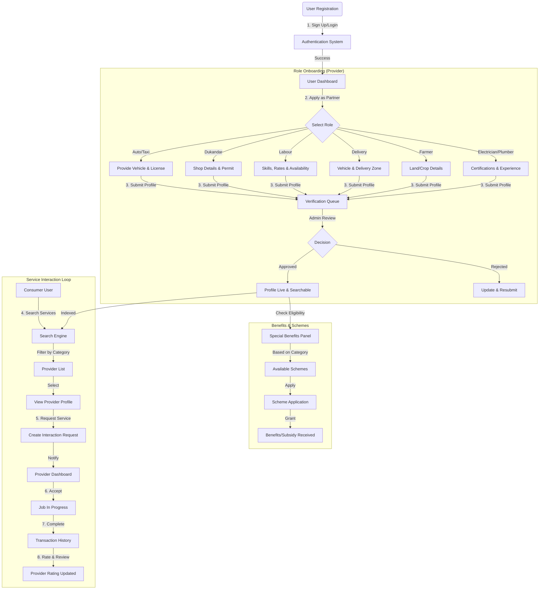

# System Flow Diagram & Schema Overview

## 1. Flow Diagram (Mermaid)

## 2. Refined Schema Architecture

We have transitioned from a generic `Company` model to a more specific `Provider` model that better represents individual workers and small business owners.

### Updated Schemas

1.  **User Schema** (`user.schema.ts`)
    *   **Unified Identity**: Serves as the base login for everyone.
    *   **Roles**: Added `roles: ['user', 'provider', 'admin']` to allow a single account to act as both a consumer and a provider.

2.  **Provider Schema** (`provider.schema.ts`)
    *   **Replaces**: `Company` schema.
    *   **Categories**: Strictly typed to `Auto / Taxi`, `Dukandar`, `Labour`, `Delivery`, `Farmer`, `Electrician / Plumber`.
    *   **Fields**: Includes `skills`, `vehicleNumber`, `shopCategory` to accommodate diverse roles.
    *   **Location**: Geospatial indexing (`2dsphere`) for map-based searching (e.g., "Find Electrician near me").

3.  **Interaction Schema** (`interaction.schema.ts`)
    *   **Purpose**: Tracks the lifecycle of a service (Requested -> Accepted -> Completed).
    *   **Feedback**: Built-in rating and review system.

## 3. Usage Guide

*   **For Consumers**: Query the `Provider` collection by `location` and `category`.
*   **For Providers**: Users create a `Provider` document linked to their `userId`.
*   **For Benefits**: Query the `Scheme` collection where `category` matches the Provider's category.
